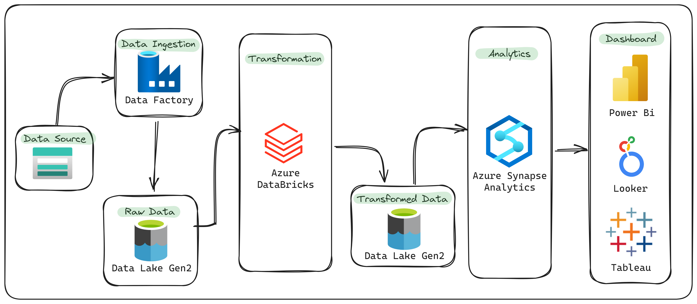

# Azure Tokyo Olympics Project
Azure Tokyo Olympics End-to-End Project. Azure Data Services used - Azure Data Factory, Azure Data Lake Gen2, Azure Databricks, Azure Synapse Analytics, PowerBi Tools.

### Step to complete end to end projects

- Upload dataset in github.
- Create a pipeline in azure data factory for copy data from github to azure data lake gen2.
- Apply basic transformation on raw data in azure databricks.
- Saved transformed data to again in azure data lake gen2.
- Create lake warehouse from transformed data in azure synapse analytics and analyses data.
- Create a dashboard in power bi from lake warehouse data.

### Flow Chart for project
 

